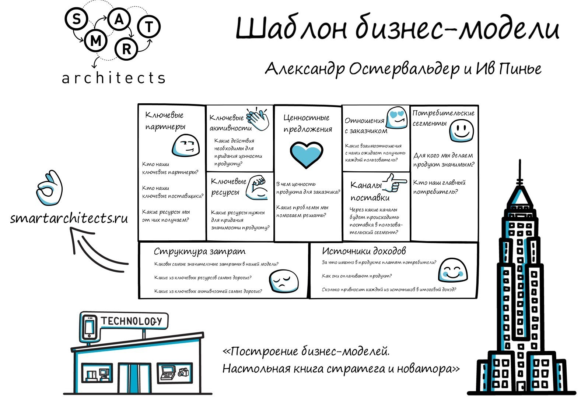

## 1. Моделі бізнес проектів

	Існує безліч підходів до визначення поняття бізнес-модель, що роблять акцент на різних складових елементах. Наведемо деякі приклади.

**Бізнес-модель** - це метод ведення бізнесу, за допомогою якого організація забезпечує принесення прибутку. Бізнес-модель роз'яснює, як організація заробляє гроші.

**Бізнес-модель** - це структура бізнес процесів і зв'язків між ними, які використовуються для планування, контролю і корекції діяльності організації.

**Бізнес-модель** - це логічний схематичний опис бізнесу, покликаний допомогти в оцінці ключових факторів успіху організації.

**Бізнес-модель** - це спосіб, яким організація створює цінність для споживачів і отримує від цього прибуток.

         Найбільш популярним і актуальним інструментом бізнес-моделювання на сьогоднішній день є Шаблон бізнес-моделі, розроблений **Олександром Остервальдер** і **Івом Пинье**.  
    
    **Шаблон** (або як іноді його переводять: канва, макет) - це універсальна мова опису, подання, аналізу та перетворення бізнес-моделей. Він складається з 9 блоків, що дозволяють просто і наочно описати і представити діяльність організації на одному аркуші.

### **Перший блок**  

**Перший блок** - споживчі сегменти. В даному блоці визначається, які групи споживачів компанія розраховує залучати й обслуговувати.

Щоб краще задовольняти потреби клієнтів, бажано розбити їх на групи за потребами, особливостями поведінки і іншими ознаками, тобто виділити цільові аудиторії або споживчі сегменти.

Групи клієнтів представляють різні сегменти, якщо:

\-     відмінності в їх запитах обумовлюють відмінності в пропозиціях;

\-     взаємодія здійснюється по різних каналах збуту;

\-     -взаємини з ними потрібно будувати по-різному;

\-     їх вигідність істотно різниться;

\-     їх приваблюють різні аспекти пропозиції.

У різних бізнес-моделях виділення споживчих сегментів може здійснюватися по-різному, наприклад:

\-     бізнес-моделі, що відносяться до пропозиції товарів широкого споживання, не проводять відмінностей між споживчими сегментами і орієнтовані на велику групу споживачів, об'єднаних подібними потребами;

\-     бізнес-моделі нішевих ринків орієнтовані на особливі споживчі сегменти;

\-     деякі бізнес-моделі виділяють сегменти ринку, що незначно відрізняються по потребам і запитам, т.зв. дробове сегментування;

\-     організації з багатопрофільною бізнес-моделлю обслуговують кілька абсолютно різних споживчих сегментів з різними потребами і запитами;

\-     деякі організації обслуговують два або більше взаємопов'язаних споживчих сегмента, для того щоб така бізнес-модель працювала, необхідні обидва сегмента.

### **Другий блок**

**Другий блок** - ціннісні пропозиції. Блок включає опис товарів і послуг, які представляють цінність для певного споживчого сегмента.

**Ціннісня пропозиція** - це сукупність переваг, які компанія готова запропонувати споживачеві.

Переваги можуть бути кількісними або якісними, наприклад:

1)   Новизна: деякі ціннісні пропозиції орієнтовані на задоволення абсолютно нових потреб, яких на ринку раніше просто не існувало;

2)   Продуктивність: підвищення ефективності чи продуктивності продукції традиційно використовується для створення ціннісного пропозиції;

3)   Виготовлення на замовлення: товари і послуги, що задовольняють індивідуальні запити клієнтів або вузькі споживчі сегменти, мають високу цінність;

4)   «Робити свою роботу»: цінність можна створити і за рахунок допомоги клієнту у виконанні його роботи;

5)   Дизайн: дуже важливий елемент, з великими труднощами піддається оцінці, але який може стати найбільш важливим елементом ціннісного пропозиції;

6)   Бренд / статус: з точки зору споживача цінність може полягати просто в демонстрації певного бренду;

7)   Ціна: пропозиція тих же переваг за нижчою ціною - стандартний шлях задоволення запитів чутливих до цін споживчих сегментів;

8)   Зменшення витрат: допомога споживачам у зниженні їх витрат - відмінний спосіб створення цінності;

9)   Зниження ризику: суттєвою цінністю для споживача може стати зниження рівня ризику, з яким він стикається при купівлі товарів і послуг;

10) Доступність: ще один шлях створення цінності - зробити товари і послуги доступними для тих груп громадян, які раніше не мали до них доступу;

11) Зручність / застосовність: цінністю може стати і зручність використання товару.

### **Третій блок**

**Третій блок** - канали взаємодії. Блок описує, як компанія взаємодіє зі споживчими сегментами і доносить до них свої ціннісні пропозиції.

Канали зв'язку, поширення і продажів складають систему взаємодії компанії з клієнтом.

Ці канали виконують ряд функцій, зокрема:

\-     підвищують ступінь поінформованості споживача про товари і послуги організації;

\-     допомагають оцінити ціннісні пропозиції організації;

\-     дозволяють споживачеві купувати товари та послуги;

\-     забезпечують післяпродажне обслуговування.

Канали збуту є п'ять етапів просування товару до споживача:

1)   Інформаційний: як ми підвищуємо обізнаність споживача про товари і послуги нашої компанії?

2)   Оціночний: як ми допомагаємо клієнтам оцінювати ціннісні пропозиції нашої компанії?

3)   Продажний: яким чином ми надаємо клієнтам можливість придбання певних товарів і послуг?

4)   Доставка: як ми доставляємо клієнтам наші ціннісні пропозиції?

5)   Післяпродажний: як ми забезпечуємо клієнтам післяпродажне обслуговування?

Кожен канал може включати всі етапи або лише частина з них, можна виділити прямі та непрямі канали збуту, а також власні і партнерські.

 

### **Четвертий блок**

**Четвертий блок** - взаємини зі споживачами. Блок описує типи відносин, які встановлюються у компанії з окремими споживчими сегментами.

Компанія повинна чітко визначити, який тип взаємин вона хоче встановити з кожним зі споживчих сегментів, вони можуть варіюватися від персональних до автоматизованих.

Можна виділити кілька типів взаємин з клієнтами, існуючих в рамках відносин організації з кожним споживчим сегментом:

1)   Персональна підтримка: клієнт може спілкуватися безпосередньо з представником компанії, отримуючи від нього допомогу в процесі купівлі та після неї;

2)   Особлива персональна підтримка: в даному випадку представник компанії прикріплений до конкретного клієнта, з яким у нього складаються свої взаємини;

3)   Самообслуговування: при такому типі взаємин компанія не підтримує безпосередніх стосунків з клієнтами, але забезпечує їх всім необхідним, щоб вони могли обслуговувати себе самостійно;

4)   Автоматизоване обслуговування: цей тип взаємин представляє поєднання більш складної форми самообслуговування з автоматизацією процесів;

5)   Спільноти: багато компаній підтримують онлайн-спільноти, надаючи користувачам можливість обмінюватися знаннями. Спільноти допомагають компаніям краще розуміти потреби своїх клієнтів;

6)   Спільне виробництво: багато компаній сьогодні виходять за рамки традиційних відносин продавець - покупець і створюють цінність спільно зі споживачем, наприклад залучаючи клієнтів до створення дизайну продуктів або виробництва контенту.

### П'ятий блок

**П'ятий блок** - фінансова стійкість. Блок включає матеріальну прибуток, яку компанія отримує від кожного споживчого сегменту або від партнерів.

Компанія повинна запитати себе: за що готові платити клієнти? Правильна відповідь на це питання дозволить створити один або кілька потоків надходження доходів.

Існує ряд способів створення потоків доходів:

1)   Продаж активів: найочевидніший потік надходження доходу - доходи від продажу прав власності на матеріальний продукт;

2)   Плата за використання: цей потік виникає з оплати користування певною послугою. Чим більше клієнт користується сервісом, тим більше він за нього платить;

3)   Оплата підписки: це потік доходу від продажу тривалості доступу до послуги;

4)   Оренда / рента / лізинг: цей потік створюється шляхом передачі клієнту тимчасових прав на користування певною активом протягом певного періоду часу за фіксовану плату;

5)   Ліцензії: в цьому випадку потік доходу створюється за рахунок передачі прав на користування захищеної інтелектуальною власністю;

6)   Брокерські відсотки: потік доходів надходить і від посередницьких послуг, які надаються двом або більше сторін в ході операції;

7)   Реклама: даний потік доходів створює оплата реклами товару, послуги чи торгової марки.

### Шостий блок

**Шостий блок** - ключові ресурси. У цьому блоці описуються найбільш важливі активи, необхідні для функціонування бізнес-моделі.

Ці активи дозволяють організації створювати і доносити до споживача ціннісні пропозиції, виходити на ринок, підтримувати зв'язки з споживчими сегментами і отримувати прибуток.

Ключові ресурси можна класифікувати наступним чином:

·     **Матеріальні ресурси**: до цієї категорії відносяться фізичні об'єкти, такі як виробничі потужності, будівлі, обладнання, транспортні засоби, точки продажу і мережі дистрибуції;

·     **Інтелектуальні ресурси**: інтелектуальна власність, наприклад торгові марки, закрита інформація, захищена правами власності, патенти і авторські права, партнерські і клієнтські бази даних;

·     **Персонал:** підбір персоналу - важливе завдання для будь-якого підприємства, але є бізнес-моделі, що вимагають особливо уважного ставлення до цього ресурсу, наприклад в наукомістких виробництвах або творчих колективах;

·     **Фінанси:** ряд бізнес-моделей вимагає наявності певних фінансових ресурсів і / або фінансових гарантій, таких як грошові кошти, кредитні лінії або фондовий резерв.

### **Сьомий блок** 

**Сьомий блок** - ключові види діяльності. Блок описує дії компанії, які необхідні для реалізації її бізнес-моделі.

Кожна бізнес-модель включає певну кількість ключових видів діяльності. Це найважливіші дії організації, без яких її успішна робота неможлива.

Ключові види діяльності можна класифікувати наступним чином:

1. Виробництво: ця діяльність включає розробку, створення і виведення на ринок продукту в необхідному обсязі та / або найкращій якості. Виробнича діяльність - головна для бізнес-моделей компаній-виробників;
2. Дозвіл проблем: ця діяльність полягає в пошуку оптимального рішення проблем конкретного клієнта. Ключова активність цього типу переважає в роботі організацій, що надають послуги;
3. Платформи / мережі: в бізнес-моделях, заснованих на платформі як ключовому ресурсі, головними видами діяльності є ті, що пов'язані з цією платформою або мережею. В якості платформи можуть виступати комп'ютерні мережі, комерційні платформи, програмне забезпечення та навіть торговельні марки.

 

### **Восьмий блок** 

**Восьмий блок** - ключові партнери. Блок описує мережу постачальників і партнерів, завдяки яким функціонує бізнес-модель.

Організації будують партнерські відносини, щоб оптимізувати свої бізнес-моделі, знизити ризики або отримати ресурси, і подібні відносини стають основою багатьох бізнес-моделей.

Можна виділити чотири типи партнерських відносин:

1. Стратегічне співробітництво між неконкуруючих організаціями;

2. Соконкуренція: стратегічне партнерство між конкурентами;

3. Спільні підприємства для запуску нових бізнес проектів;

4. Відносини виробника з постачальниками для гарантії отримання якісних комплектуючих.

Можна виділити три основні мотиви створення партнерських відносин:

1. Оптимізація і економія в сфері виробництва: ця основна форма партнерства або відносин між замовником і постачальником з метою оптимізації розподілу ресурсів і ведення діяльності;
2. Зниження ризику і невизначеності: партнерські відносини можуть допомогти знизити ризик в конкурентному середовищі, для якої характерна невизначеність. Нерідко компанії формують стратегічний союз в одній області, в інших залишаючись конкурентами;
3. Поставки ресурсів і спільна діяльність: лише деякі компанії володіють усіма ресурсами або виконують всі види діяльності, які включає в себе їх бізнес-модель. Зазвичай вони передають функції видобутку і постачання деяких ресурсів і виконання певних дій своїм партнерам.

### **Дев'ятий блок**

**Дев'ятий блок** - структура витрат. Блок описує найбільш суттєві витрати, необхідні для роботи в рамках конкретної бізнес-моделі.

Витрати досить легко підрахувати, якщо ви точно визначили ключові ресурси, ключові види діяльності і ключових партнерів.

Мінімізувати витрати слід в будь-який бізнес-моделі, однак для деяких моделей зниження витрат має більше значення, ніж для інших.

За структурою витрат має сенс розділити бізнес-моделі на два класи: з переважною увагою до витрат і з переважною увагою до цінності (більшість бізнес-моделей знаходяться десь між цими двома крайностями).

За структурою витрати можна розділити на наступні категорії:

1. Фіксовані витрати: витрати, які залишаються незмінними незалежно від обсягу товарів або послуг;
2. Змінні витрати: витрати, які змінюються в залежності від обсягу товарів або послуг;
3. Економія на масштабі: зниження витрат, що відбувається в результаті збільшення випуску продукції;
4. Ефект диверсифікації: це перевага компанія отримує в результаті більшого спектру операцій.

## 2. Управління артефактами

Поняття «артефакт» включає в себе процеси управління проектом, входи, інструменти, методи, виходи. Керівник проекту і команда управління проектом вибирають і пристосовують відповідні артефакти для використання в конкретному проекті. Цей процес «вибору» і «пристосування» зазвичай називають «адаптацією». Адаптація необхідна, оскільки кожен проект є унікальним, і внаслідок чого не всякий процес, вхід, інструмент, метод або вихід потрібен для кожного проекту.

План управління проектом є найбільш поширеним артефактом. Він має багато компонентів, таких як допоміжні плани управління, базові плани і опис життєвого циклу проекту. Допоміжні плани управління - це плани, пов'язані з конкретним аспектом або областю знань проекту, наприклад, план управління розкладом, план управління ризиками та план управління змінами. Частиною адаптації є визначення компонентів плану управління проектом, необхідних для даного проекту. План управління проектом є одним з основних артефактів проекту, проте є інші документи, які не входять до складу плану управління проектом, але використовуються для управління проектом.

Зазначені «інші документи» називаются документами проекту. Як і компоненти плану управління проектом, перелік необхідних для того чи іншого процесу документів проекту залежить від особливостей конкретного проекту. За вибір необхідних для того чи іншого процесу документів проекту, а також документів проекту, які будуть оновлені на виході процесу, відповідає керівник проекту.

## 3. Артефакти
Артефакт - це "порція" інформації, що породжується, модифікується або використовується процесом. - це речові продукти проекту: об'єкти, 
що породжуються або використовуються проектом при роботі над остаточним продуктом. Виконавцями видів діяльності артефакти використовуються 
як вихідна інформація і є результатом або виходом цих видів діяльності. Згідно об'єктно-орієнтованої проектної термінології, де види 
діяльності - це операції над активним об'єктом (виконавцем), артефакти - це параметри цих процесів. Артефактами можуть бути:

• модель, така як модель прецедентів або модель проектування;

• елемент моделі (елемент в рамках моделі), такий як клас, прецедент або підсистема;

• документ, такий як бізнес-план або документ архітектури програмного забезпечення;

• вихідний код;

• виконувані програми.

Відзначимо, що артефакт- це термін, використовуваний в Rational Unified Process (приклади декількох основних артефактів Rational 
Unified Process наведені на рис. 3.3). Інші процеси для позначення того ж поняття використовують терміни результат роботи, робочий 
блок і т.п. Відзначимо також, що комплектуючі вузли, що надходять в руки замовників і кінцевих користувачів, - це тільки підкласи 
всіх артефактів.

[**Глава 3. Статична структура: опис процесу**](http://src-code.net/artefakty/)

Можуть бути складовими інших артефактів. Наприклад, модель проектування містить множинні класи; план розробки програмного забезпечення 
включає кілька інших планів: план кадрового забезпечення, план фаз, план метрик, плани ітерацій і т.д.

Досить часто вимагають управління їх версіями і конфігурацією. Елементарні артефакти іноді буває неможливо підпорядкувати цій процедурі,
тому доводиться управляти версіями складеного артефакту. Наприклад, можна управляти версіями всієї моделі проектування або пакетом 
проектування (але не окремими класами і їх складовими). Як правило, артефакти- це не документи. Багато процесів акцентують увагу 
на документах, зокрема друкованих документах. 

Rational Unified Process не схвалює планомірне створення друкованих документів. Найефективнішим і практичним підходом до управління 
артефактами проекту є підтримка артефактів в межах відповідних інструментальних засобів, що використовуються для створення артефактів 
і управління ними. При необхідності ці кошти дозволяють миттєво створювати потрібні документи (знімки процесу). Що поставляються 
зацікавленим сторонам, також потрібно розглядати не на папері, а нерозривно з інструментальними засобами. Такий підхід гарантує 
"свіжу" інформацію і те, що вона буде ґрунтуватися на дійсній проектній роботі і її отримання не вимагатиме додаткової роботи.

Наведемо приклади артефактів.

• Проектна модель, збережена в Rational Rose в План проекту, який було збережено в Microsoft Project

• Дефект, який було збережено в ClearQuest

• База даних вимог проекту в Requisite Pro

У той же час певні артефакти повинні бути простими текстовими документами, як, наприклад, в разі поставки інформації ззовні проекту. 
Крім того, звичайний текст - це іноді кращий засіб уявлення описової інформації.

За артефакти відповідає один виконавець; це є розвитком того, що за кожну "порцію" інформаціі має відповідати конкретна особа. 
Незважаючи на те що "володіти" артефактом може тільки одна особа, використовувати його можуть багато людей, які, при наявності 
відповідного дозволу, можуть навіть модернізувати цей артефакт.
називаються з використанням слова "артефакт", наприклад Артефакт: архів прецедентів.

#### Звіти

Моделі і елементи моделей можуть супроводжуватися звітами. Звіт витягує інформацію про модель і елементах моделі з інструментальних 
засобів. Наприклад, звіт надає артефакт або безліч артефактів для рецензування. На відміну від звичайних артефактів, звіти 
не потребують управлінні версіями; їх можна відтворювати в будь-який час. Для цього потрібно всього лише повернутися 
до їх породили артефактів.

#### Безлічі артефактів

Rational Unified Process згруповані в п'ять інформаційних множин.

• Безліч управління

• Безліч вимог

• Безліч проектування

• Безліч реалізації

• Безліч поширення

Безліч управління об'єднує артефакти, пов'язані з управління проектом і сфері програмного забезпечення.

• планування, такі як план розробки програмного забезпеня (software development plan - SDP), бізнес-план, дійсний примірник процесу, 
який використовується в проекті (план розробки) і т. д.

• операційні артефакти, такі як опис версії, оцінка стану, документація по поширенню і інформація про дефекти

Безліч вимог включає артефакти, пов'язані з визначенням розробляється програмної системи.

• Документ бачення

• Вимоги у формі запитів зацікавлених сторін, моделі прецедентів і додаткових специфікацій

• Модель виробництва, якщо вона потрібна для розуміння процесів, що підтримуються системою

Безліч проектування містить опис створюваної (або створеної) системи в формі:

• моделі проектування;

• опису архітектури;

• моделі тестування.

Безліч реалізації включає наступне.

• Вихідний код і виконувані програми

• Супутні інформаційні файли або файли, необхідні для їх отримання

Безліч поширення містить всю продукцію, що поставляється інформацію.

• матеріали по установці

• інформацію користувача документацію

• навчальні матеріали

Не є чимось завершеним або хоча б зафіксованим в одній фазі ітеративного процесу розробки до переходу до наступної фази. 
Навпаки, за час життєвого циклу розробки п'ять інформаційних множин еволюціонують, вони ростуть, як показано на рис. 3.4.
Всі артефакти, певні в Rational Unified Process для всіх технологічних процесів, перераховані в додатку Б.

source: http://src-code.net/artefakty/

## 4. Взаємодія бізнес проектів і артефактів

### 	4.1 Основні артефакти

**Примітка –** Bикористовуються позначення: 

- **M** – модель;
- **D** – документ;
- **E** – элемент моделі.

| **Артефакт**                                                 | **Тип** | **Короткий опис змісту**                                     |
| ------------------------------------------------------------ | ------- | ------------------------------------------------------------ |
| Модель бізнес-процесів [Business Use Case Model]             | M       | Модель функцій (процесів), які виконуються організацією і ролей зовнішніх організаційних чи інших систем, що взаємодіють з моделюється організацією. |
| Бізнес-правила  [Business Rules]                             | D       | Документ, який визначає різні політики і умови, які повинні бути виконані. |
| Модель бізнес-об'єктів [Business Object Model]               | M       | Об'єктна модель, що описує інформаційну та рольову структуру предметної області та реалізацію бізнес-процесів в їх термінах. Містить бізнес-сутності [business-entities], бізнес-виконавців [business-workers], організаційні одиниці [organization unit]. |
| Бізнес-процес [Business Use Case] (або Специфікація бізнес-процесу [Business Use-Case Specification]) | M(D)    | Елемент Моделі бізнес-процесів, що визначає бізнес-процес, що виконується в рамках модельованої організації. |
| Бізнес-модель [Business Model]                               | M       | Похідний артефакт, доповнює RUP. Повна модель досліджуваної предметної області, що складається з Моделі бізнес-процесів і Модель бізнес-об'єктів. |
| Концепція розвитку організації [Business Vision]             | D       | Це впливає на доступність цілей і підхід до бізнес-моделювання. |
| Додаткові вимоги до діяльності організації [Supplementary Business Specification] | D       | Документ містить опис предметної області, яка не відображена / не може бути відображена в моделі бізнес-процесів. |
| Оцінка цільової організації [Target Organization Assessment] | D       | Описує поточний статус організації, для якої розроблятиметься система. Опис дається в термінах виконуваних процесів, інструментальних засобів, споживачів, конкурентів, проблемних областей і т.п. |
| Протокол перевірки [Review record]                           | D       | Містить результати виконаної перевірки Бізнес-моделі.        |
| Контрольні питання                                           | D       | Містить перелік контрольних питань для всіх ключових артефактів, що створюються в процесі розробки ПС. |
| Бізнес-сутність [Business entity]                            | E       | Елемент Моделі бізнес-об'єктів. Пасивний клас, який не ініціює взаємодію. Бізнес-сутність являє собою деяку пасивну сутність предметної області, з якою взаємодіє бізнес-виконавець (маніпулює, виробляє, інспектує і т.п.). |
| Бізнес-виконавець [Business worker]                          | E       | Елемент Моделі бізнес-об'єктів. Клас, який є абстракцією людини, який виконує деякі функції всередині системи. Бізнес-виконавець взаємодіє з іншими виконавцями та маніпулює бізнес-сутностями, беручи участь в реалізації бізнес-процесів. |
| Організаційна одиниця [Organization unit]                    | E       | Елемент Моделі бізнес-об'єктів. Набір бізнес-виконавців, бізнес-сутностей, відносин, реалізацій бізнес-процесів, діаграм і інших організаційних одиниць. Використовується для структуризації моделі бізнес-об'єктів розподілом її на менші частини. |
| Глосарій предметної області [Business Glossary]              | D       | Визначає терміни предметної області, що використовуються при бізнес-моделюванні. |
| Додаткова специфікація системи                               | D       | Артефакт процесу                                             |
| Модель варіантів використання                                | M       | Артефакт процесу                                             |

### 	4.2 Взаємодія артефактів

У ході опису життєвого циклу ключового артефакту багато завдань на цьому шляху можуть знадобитися консультувати або змінювати інші артефакти в бізнесі. Оскільки інші артефакти мають свої життєві цикли, ці залежності являють собою два різновиди життєвого циклу. Посилання на інший артефакт в задачі створює залежність. Необхідність модифікації іншого артефакту - це сильніша взаємодія, в якій обидва артефакти знаходяться в одній задачі. У випадку модифікації життєві цикли артефакту перетинаються, оскільки розглянута задача є частиною життєвого циклу обох артефактів. Повна операційна модель підприємства складається з життєвих циклів усіх артефактів, що знаходяться під контролем бізнесу. Ці взаємодіючі життєві цикли охоплюють залежності між різними артефактами бізнесу. Наш підхід до побудови загальноприйнятої опіраційної моделі полягає в тому, щоб повторити наступні кроки:

1. Виберіть артефакти та побудуйте життєві цикли.
2. Створіть список кандидатів усіх артефактів, з якими були або проаналізовані, або модифіковані при побудові вибраного життєвого циклу артефакту.
3. Повторіть це, доки в списку кандидатів не буде більше артефактів:

- Вийняти артефакт X зі списку кандидатів.
- Побудувати життєвий цикл X.
- Додайте до списку кандидатів щойно виявлені артефакти.

Основна передумова досить проста. Для кожного артефакту в бізнесі повинен бути набір операцій, отже, життєвий цикл для його збереження. Операційна модель дозволяє збирати наступні відомості про завдання, як застосовні:

- Стратегічний намір, конкретні стратегічні причини, чому це завдання виконується
- Роль або організація, яка виконує це завдання
- Система або програма, яка автоматизує або підтримує задачі

Оскільки стратегія є надто широкою та загальною сферою, ми зосереджуємось на стратегії як на заявах про бізнес. Часто зв'язок між стратегією, операціями та системами неформальний. Отже, важко забезпечити зв’язок між стратегічною ініціативою, її операційними наслідками та подальшою її реалізацією в системах інформаційних технологій (ІТ) компанії. Оперативно-орієнтований вигляд дозволяє наводити висловлювання стратегії з точки зору оперативних елементів, наприклад, рішень щодо артефактів та їх обробки. Конкретні елементи стратегії можуть бути додані до елементів базового моделювання, завдань та сховищ як атрибути. З точки зору інструменту, це дозволяє лідеру бізнесу виділити всі завдання, які підтримують задану стратегію.

Метрики (міри кількісної оцінки, які зазвичай використовуються для оцінки, порівняння та відстеження результатів чи виробництва) тісно пов'язані зі стратегією, оскільки деякі аспекти стратегії насправді є твердженнями про метрики. У більшості випадків показники будуть похідними з інформації, яка зафіксована в артефактах бізнесу. Іноді потрібно створити спеціальний артефакт для обробки метрики, яка передбачає агрегацію інформації, наприклад, віджети, оброблені за годину. Аналогічно, фактичне завдання докори можна використовувати для включення KPI (ключових індикаторів процесів) у моделі OpS. Організаційний погляд легко витягнути з експлуатаційної моделі.

Механіка створення зосередженого на застосуванні виду така ж, як і вищезгадана; Єдина відмінність - основа агрегації. Результатний графік може розглядатися як своєрідна діаграма архітектури. Операційна модель також може бути основою для побудови системи автоматизації з нуля.

Операційна модель, коли вона повністю розроблена, містить всю інформацію про бізнес, необхідну для створення системи автоматизації. Це саме те, що ми зробили для клієнта з медичного страхування, який перетворювався на керовану компанію. Сила такого підходу полягає у відповідності між бізнес-завданнями та прикладними програмами, що їх автоматизують. Отже, зміна впровадження ІТ, оскільки бізнес змінюється, стає дуже ефективним; ділова особа може дуже точно сказати нам, які зміни потрібно внести на рівні OpS. Зараз ведеться більш сучасна спроба розвитку автоматизації. Модель бізнес-рівня. Прототип розроблений для компіляції моделі бізнес-рівня безпосередньо до кістяка середнього програмного забезпечення або веб-служб.

