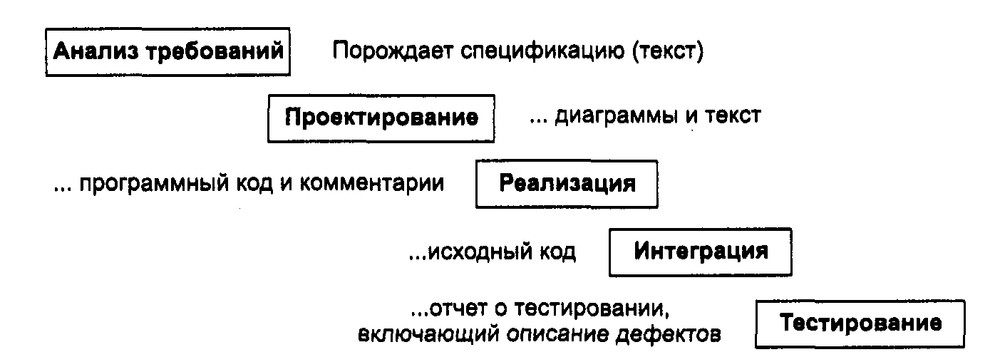

# OBD2019

**Програмний проект** - це сукупність дій, необхідна для створення артефакту. Проект включає контакт з замовником, написання документації, проектування, написання коду і тестування продукту. 

https://project.dovidnyk.info/index.php/home/tehnologiyarazrabotkiprogrammnogoobespecheniya/20-vvedenie

**Проектування програмного забезпечення** - процес створення проекту програмного забезпечення (ПО), а також дисципліна, що вивчає методи проектування.

Проектування передбачає вироблення властивостей системи на основі аналізу постановки задачі, а саме: моделей предметної області, вимог до програмного забезпечення, а також досвіду проектувальника.

Модель предметної області накладає обмеження на бізнес-логіку і структури даних.

Вимоги до ПО визначають зовнішні (видимі) властивості програми, що розглядається як чорний ящик.

Визначенню внутрішніх властивостей системи і деталізації її зовнішніх властивостей власне і присвячено проектування.

Проектування ПО є окремим випадком Проектування продуктів і Проектування систем.

Залежно від класу створюваного ПО, процес проектування може забезпечуватися як «ручним» проектуванням, так і різними засобами його автоматизації. В процесі проектування ПО для вираження його характеристик використовуються різні нотації - блок-схеми, ER-діаграми, DFD-діаграми, а також макети.

*Проектування зазвичай підлягають:*
* архітектура ПО
* Конструкція компонентів ПО
* призначені для користувача інтерфейси

Результат проектування представляється у вигляді комплексу документів під назвою «Ескізний проект», «Технічний проект», Software Architecture Document, Software Design Document.

**Аспекти проекту:**
* Об'єктно-орієнтований підхід: дуже корисна парадигма.
* Уніфікована мова моделювання (UML): нотація для проектування.
* Успадковані системи: старт для поліпшення або розширення існуючої системи.

Об'єктно-орієнтований підхід може бути дуже корисний при розробці проекту. Він особливо ефективний при наявності постійних змін всередині проекту, так як допомагає розподілити суті проектування і вихідний код по частинах (класам і модулів), краще відображає проблему предметної області. 

Уніфікована мова моделювання (UML - Unified Modeling Language) - промисловий стандарт для опису моделей. UML - це не методологія, а система позначень. Описаний підхід запозичує ідеї з області вивчення зразків проектування і з досліджень по класифікації архітектури програмного забезпечення. 

Величезна кількість розробок не націлена на створення нових систем, а покликані поліпшити або повинні використовувати вже існуючі (успадковані) системи. Навіть представляються абсолютно новими програми зазвичай мають співіснувати з успадкованими системами. Однак важко зрозуміти, як працювати з успадкованими системами, не маючи уявлення про те, як в принципі повинні створюватися системи.  Тут https://project.dovidnyk.info/index.php/home/tehnologiyarazrabotkiprogrammnogoobespecheniya/20-vvedenie про Введення

**Управління проектом**

Управління проектом полягає в управлінні виробництвом продукту в рамках відведених коштів і часу. Оскільки для цього потрібні людські ресурси, то для управління проектом необхідні не тільки технічні і організаційні навички, але ще і мистецтво управління людьми. 

**Складові управління проектом.** 

*Управління проектом охоплює* :
* інфраструктуру (організаційні моменти) ;
* керуючий процес (права і відповідальності учасників)
* процес розробки (методи, інструменти, мови, документація і підтримка) ;
* розклад (моменти часу, до яких повинні бути представлені виконані фрагменти роботи).

*Основні параметри:* вартість, функціональність, якість і розклад. Планувальники проекту можуть варіювати вартість, можливості, якість і дату завершення проекту. 
*Керівник проекту може керувати наступними факторами.*
1. Загальна вартість проекту. Наприклад, збільшувати витрати. 
2. Можливості продукту. Наприклад, видаляти їх зі списку можливостей продукту. 
3. Якість продукту. Наприклад, збільшувати середній час напрацювання на відмову (MTBF). 
4. Загальна тривалість проекту. Наприклад, скоротити розклад на 20% або відкласти завершення проекту на один місяць. 

https://project.dovidnyk.info/index.php/home/tehnologiyarazrabotkiprogrammnogoobespecheniya/22-upravlenieproektom про Управління проектом
