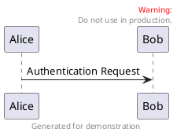
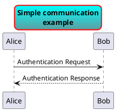

# Some Uml Diagrams

```plantuml
@startuml
Alice -> Bob: Authentication Request

header
<font color=red>Warning:</font>
Do not use in production.
endheader

center footer Generated for demonstration

@enduml
```

text

```plantuml
@startuml
skinparam titleBorderRoundCorner 15
skinparam titleBorderThickness 2
skinparam titleBorderColor red
skinparam titleBackgroundColor Aqua-CadetBlue

title Simple communication\nexample

Alice -> Bob: Authentication Request
Bob --> Alice: Authentication Response

@enduml
```

