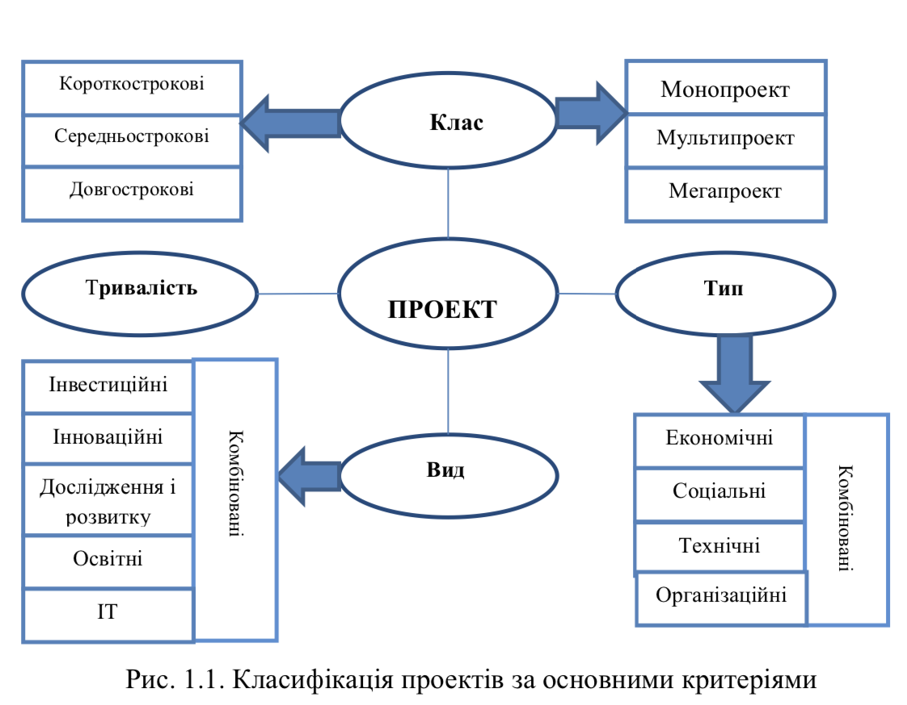

# Поняття про проект
У сучасному розумінні поняття “проект” тлумачать так: 

- це діяльність, захід, що передбачає виконання комплексу певних дій для досягнення певних цілей (одержання певних результатів); близькі за змістом терміни — “господарська діяльність”, “робота (комплекс робіт)”;

- це система організаційно-правових і розрахунково-фінансових документів, необхідних для виконання певних дій або таких, що описують ці дії.

**Проект** — це сукупність цілеспрямованих, послідовно орієнтованих у
часі, одноразових, комплексних і нерегулярно повторюваних дій (заходів або робіт), орієнтованих на досягнення кінцевого результату в умовах обмеженості ресурсів і заданості термінів їх початку і завершення.
Формулювання понять, особливо мультискладних (яким є зокрема поняття проекту), як правило, не претендують на єдиність і повноту охоплення всіх ознак поняття, що вводиться. Тому наведемо ще декілька відомих визначень поняття "проект".

**Мета проекту** – доказовий результат і задані умови реалізації загального завдання проекту.
З точки зору теорії систем управління проект як об’єкт управління повинен бути контрольованим і керованим, тобто виділяються певні характеристики, за якими можна постійно контролювати хід виконання проекту (**контрольованість**).

Слово проект дуже часто вживається у нашому житті. Це, зокрема, такі ознаки:

- ### Спрямованість на досягнення мети.
Проекти спрямовуються на досягнення певних результатів — іншими словами, на досягнення мети. Саме ця мета є рушійною силою проекту, і всі зусилля, що докладаються до його планування та реалізації, спрямовані на її досягнення.

- ### Проекти мають численні ієрархічні цілі.
Основною метою, наприклад, проекту, пов’язаного з програмним забезпеченням для комп’ютера, може бути розробка складної системи управління базами даних. Проміжною метою може бути тестування системи в процесі розробки для налаштування програм, а метою нижчого рівня — визначення дат, коли працівники, що розробляють проект, звітуватимуть про свої результати на оперативній нараді.

- ### Координоване виконання пов’язаних між собою дій. 
Сама сутність проектів визначає складність їхнього втілення в життя. Проекти потребують виконання численних завдань, жорстко або гнучко взаємопов’язаних: деякі проміжні завдання не можуть реалізовуватися, доки не завершені інші завдання; інші завдання мають виконуватися паралельно і т. п. Якщо порушується синхронізація виконання різних завдань, весь проект може опинитися під загрозою невиконання.

- ### Часові рамки проекту. 
Проекти виконуються протягом певного проміжку часу (хоча інколи керівникам проектів, що обстоюють виконання початкових графіків, здається, що проект не буде завершено ніколи) і мають більш-менш чітко окреслені початок і закінчення. Проект вважається завершеним, коли досягнуті його основні цілі. Під час виконання проекту значні зусилля спрямовані саме на те, щоб його було завершено у намічений термін. У цьому допомагають графіки, де зазначається час початку і закінчення робіт, які передбачаються проектом.

- ### Часові рамки проекту.
Проекти виконуються протягом певного проміжку часу (хоча інколи керівникам проектів, що обстоюють виконання початкових графіків, здається, що проект не буде завершено ніколи) і мають більш-менш чітко окреслені початок і закінчення. Проект вважається завершеним, коли досягнуті його основні цілі. Під час виконання проекту значні зусилля спрямовані саме на те, щоб його було завершено у намічений термін. У цьому допомагають графіки, де зазначається час початку і закінчення робіт, які передбачаються проектом.

- ### Унікальність.
Проекти — це певною мірою неповторні та одноразові заходи. Водночас рівень унікальності може значно коливатися залежно від особливостей проекту. Скажімо, якщо йдеться про зведення п’ятдесятого будинку у стилі «стандарт» за програмою житлової забудови, то рівень унікальності цього проекту досить скромний. Базові елементи такого будинку ідентичні елементам тих сорока дев’яти будинків, що їх було зведено раніше. Проте основні елементи унікальності можуть відбиватися у специфіці земельної ділянки, де розташовується будинок, у рішенні налагодити нову систему опалення і вентиляції або у необхідності працювати з новою бригадою фахівців і т. ін.

Загалом, саме ці п’ять ознак, або характеристик, відрізняють проекти від інших заходів, планів, програм, ініціатив.

В управлінні проектами виділяють такі основні класифікації проектів (рис.1.1).

- **класи проектів** – за складом, структурою та його предметною галуззю;

- **типи проектів** – за основними сферами діяльності, в яких реалізується проект;

- **види проектів** – за характером предметної галузі проекту, тривалістю проектів.

В управлінні проектами необхідно розрізняти поняття «проект»,«портфель проектів», «програма», які іноді неправомірно ототожнюють.

- **Програма (programme)** — це сукупність взаємопов’язаних проектів (які виконувались у минулому, тих, які виконуються сьогодні та запланованих), а також комплекс організаційних змін,об’єднаних загальними цілями і спрямованих на досягнення конкретної комерційної вигоди.

- **Портфель проектів (portfolio projects)** — множина проектів, програм та інших робіт, які виконуються у даний час і об’єднані разом з метою ефективного управління для досягнення стратегічних цілей організації; комплекс з одночасно виконуваними проектами і програми, об'єднаних власником портфеля відповідно до його стратегічних завдань.

