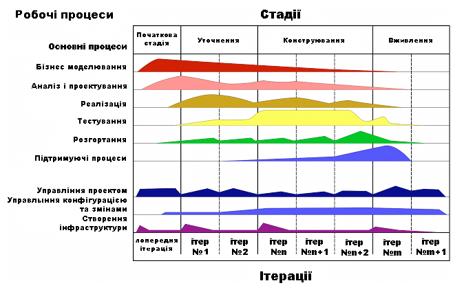

Система управління проектами
=====================
## Поняття про проект
У сучасному розумінні поняття “проект” тлумачать так: 

- це діяльність, захід, що передбачає виконання комплексу певних дій для досягнення певних цілей (одержання певних результатів); близькі за змістом терміни — “господарська діяльність”, “робота (комплекс робіт)”;

- це система організаційно-правових і розрахунково-фінансових документів, необхідних для виконання певних дій або таких, що описують ці дії.

**Проект** — це сукупність цілеспрямованих, послідовно орієнтованих у
часі, одноразових, комплексних і нерегулярно повторюваних дій (заходів або робіт), орієнтованих на досягнення кінцевого результату в умовах обмеженості ресурсів і заданості термінів їх початку і завершення.
Формулювання понять, особливо мультискладних (яким є зокрема поняття проекту), як правило, не претендують на єдиність і повноту охоплення всіх ознак поняття, що вводиться. Тому наведемо ще декілька відомих визначень поняття "проект".

**Мета проекту** – доказовий результат і задані умови реалізації загального завдання проекту.
З точки зору теорії систем управління проект як об’єкт управління повинен бути контрольованим і керованим, тобто виділяються певні характеристики, за якими можна постійно контролювати хід виконання проекту (**контрольованість**).

Слово проект дуже часто вживається у нашому житті. Це, зокрема, такі ознаки:

- ### Спрямованість на досягнення мети.
Проекти спрямовуються на досягнення певних результатів — іншими словами, на досягнення мети. Саме ця мета є рушійною силою проекту, і всі зусилля, що докладаються до його планування та реалізації, спрямовані на її досягнення.

- ### Проекти мають численні ієрархічні цілі.
Основною метою, наприклад, проекту, пов’язаного з програмним забезпеченням для комп’ютера, може бути розробка складної системи управління базами даних. Проміжною метою може бути тестування системи в процесі розробки для налаштування програм, а метою нижчого рівня — визначення дат, коли працівники, що розробляють проект, звітуватимуть про свої результати на оперативній нараді.

- ### Координоване виконання пов’язаних між собою дій. 
Сама сутність проектів визначає складність їхнього втілення в життя. Проекти потребують виконання численних завдань, жорстко або гнучко взаємопов’язаних: деякі проміжні завдання не можуть реалізовуватися, доки не завершені інші завдання; інші завдання мають виконуватися паралельно і т. п. Якщо порушується синхронізація виконання різних завдань, весь проект може опинитися під загрозою невиконання.

- ### Часові рамки проекту. 
Проекти виконуються протягом певного проміжку часу (хоча інколи керівникам проектів, що обстоюють виконання початкових графіків, здається, що проект не буде завершено ніколи) і мають більш-менш чітко окреслені початок і закінчення. Проект вважається завершеним, коли досягнуті його основні цілі. Під час виконання проекту значні зусилля спрямовані саме на те, щоб його було завершено у намічений термін. У цьому допомагають графіки, де зазначається час початку і закінчення робіт, які передбачаються проектом.

- ### Часові рамки проекту.
Проекти виконуються протягом певного проміжку часу (хоча інколи керівникам проектів, що обстоюють виконання початкових графіків, здається, що проект не буде завершено ніколи) і мають більш-менш чітко окреслені початок і закінчення. Проект вважається завершеним, коли досягнуті його основні цілі. Під час виконання проекту значні зусилля спрямовані саме на те, щоб його було завершено у намічений термін. У цьому допомагають графіки, де зазначається час початку і закінчення робіт, які передбачаються проектом.

- ### Унікальність.
Проекти — це певною мірою неповторні та одноразові заходи. Водночас рівень унікальності може значно коливатися залежно від особливостей проекту. Скажімо, якщо йдеться про зведення п’ятдесятого будинку у стилі «стандарт» за програмою житлової забудови, то рівень унікальності цього проекту досить скромний. Базові елементи такого будинку ідентичні елементам тих сорока дев’яти будинків, що їх було зведено раніше. Проте основні елементи унікальності можуть відбиватися у специфіці земельної ділянки, де розташовується будинок, у рішенні налагодити нову систему опалення і вентиляції або у необхідності працювати з новою бригадою фахівців і т. ін.

Загалом, саме ці п’ять ознак, або характеристик, відрізняють проекти від інших заходів, планів, програм, ініціатив.

В управлінні проектами виділяють такі основні класифікації проектів (рис.1.1).

- **класи проектів** – за складом, структурою та його предметною галуззю;

- **типи проектів** – за основними сферами діяльності, в яких реалізується проект;

- **види проектів** – за характером предметної галузі проекту, тривалістю проектів.

В управлінні проектами необхідно розрізняти поняття «проект»,«портфель проектів», «програма», які іноді неправомірно ототожнюють.

- **Програма (programme)** — це сукупність взаємопов’язаних проектів (які виконувались у минулому, тих, які виконуються сьогодні та запланованих), а також комплекс організаційних змін,об’єднаних загальними цілями і спрямованих на досягнення конкретної комерційної вигоди.

- **Портфель проектів (portfolio projects)** — множина проектів, програм та інших робіт, які виконуються у даний час і об’єднані разом з метою ефективного управління для досягнення стратегічних цілей організації; комплекс з одночасно виконуваними проектами і програми, об'єднаних власником портфеля відповідно до його стратегічних завдань.

## Software

**Програмне забезпечення** являє собою сукупність програм, призначених для розв’язання завдань на комп’ютері. **Програма** – це впорядкований набір команд. Програмне та апаратне забезпечення працюють взаємопов’язано і в неперервній взаємодії. Будь-який апаратний пристрій управляється програмно.

Програмне забезпечення можна поділити на три класи:

1.	системне
2.	прикладне
3.	інструментальне

## Системні програми

**Системні програми** — це програми, що забезпечують інфраструктуру, на якій можуть працювати прикладні програми, тобто вони керують і контролюють комп'ютерним обладнанням, для можливості виконання прикладних програм. Операційні системи, такі як **Microsoft Windows**, **Mac OS X** та **Linux** є яскравими прикладами системних програм.

**Системні програми** — це комп'ютерні програми, що в принципі забезпечують роботу комп'ютера. Крім операційних систем, іншими прикладами є антивірусні програми, комунікаційні програми та драйвери принтерів. Без системного програмного забезпечення комп'ютер працювати не буде.

На відміну від системного програмного забезпечення, програмні засоби, які дозволяють вам робити щось, наприклад, створювати текстові документи, грати в ігри, слухати музику або переглядати веб, називаються **прикладними**. 

В цілому **прикладні програмні засоби** — це програми, що дозволяють кінцевому користувачу виконання конкретних функцій, таких як обробляння текстів або редагування зображень.

До **інструментального** програмного забезпечення відносяться засоби розробки програмного забезпечення. Це системи програмування, що включають програмні засоби, необхідні для автоматичної побудови машинного коду. Вони є інструментами для програмістів- професіоналів і дозволяють розробляти програми на різних мовах програмування.

До складу засобів розробки програмного забезпечення входять наступні програми:

• **асемблери** - комп'ютерні програми, що здійснюють перетворення програми у формі вихідного тексту на мові асемблера в машинні команди у вигляді об'єктного коду;

• **транслятори** - програми, виконують трансляцію програми;

• **компілятори** - програми, що переводять текст програми на мові високого рівня в еквівалентну програму на машинній мові;

• **інтерпретатори** - програми, що аналізують команди або оператори програми і тут же виконують їх;

• **компоновщики** (редактори зв'язків) - програми, які виробляють компоновку - приймають на вхід один або кілька об'єктних модулів і збирають по ним здійсненний модуль;

• **препроцесори вихідних текстів** - це комп'ютерні програми, що приймають дані на вході, і видають дані, призначені для входу іншої програми, наприклад такий, як компілятор;

• **отладчики** (debugger) - програми, що є модулем середовища розробки або окремим додатком, призначеним для пошуку помилок у програмі;

• **спеціалізовані редактори вихідних текстів** - програми, необхідні для створення і редагування вихідного коду програм. Спеціалізований редактор вихідних текстів може бути окремим додатком або вбудованим в інтегроване середовище розробки та ін.

## «AML Insighter»

Система фінансового моніторингу банку (САФМ) **«AML Insighter»** являє собою рішення для банківського сектора, що підтримує всі найважливіші складові процесу протидії відмиванню коштів **(AML)**, мінімізації оподаткування та запобігання фінансування тероризму.

Система автоматизації фінансового моніторингу **«AML Insighter»** спрямована на реалізацію не тільки обов’язкових положень, а й внутрішнього фінансового моніторингу, та дозволяє вирішити ряд наступних завдань:

-	забезпечення дотримання регуляторних вимог;
-	відбір і аналіз фінансових операцій;
-	обов'язковий і внутрішній моніторинг клієнтів і транзакцій;
-	реалізація політики «Знай свого клієнта»;
-	квартальний аналіз діяльності клієнтів і моніторинг підозрілої активності (на основі правил і скоринг (ризик) механізму);
-	показ рівня ризику клієнта;
-	показ рівня ризику відділення банку;
-	показ рівня ризику банку в цілому;
-	менеджмент інцидентів;
-	складання статистичних звітів;

**Основними** функціями системи фінансового моніторингу є:

1.	Створення правил відбору фінансових операцій, що підлягають обов'язковому та внутрішньому фінансовому моніторингу.
2.	Відбір операцій і ведення реєстру здійснюється шляхом запуску вибраної групи правил.
3.	Файлообмін дозволяє в єдиному інтерфейсі бачити всі вихідні і вхідні файли та контролювати їх стан.
4.	Управління клієнтами дозволяє отримувати повний облік інформації про клієнта з облікових систем, і доповнювати новими даними, з широкими можливостями візуалізації взаємозв'язків клієнта на основі статичних зв'язків і операційної діяльності.
5.	Квартальний аналіз діяльності клієнтів (дослідження діяльності клієнтів) реалізований на основі виконання керованої скорингової моделі, підсумком відпрацювання якої є виявлення клієнтів з підозрілою поведінкою.
6.	Управління розслідуваннями інцидентів.
7.	Ідентифікаційний моніторинг, що дозволяє знаходити аномалії в даних серед клієнтів, часто є афілійованими об'єктами або особами, що намагаються уникнути ідентифікації.
8.	Здійснення перевірки інформації за внутрішніми «чорними списками», а також даними, що надходять від уповноваженого органу (ДСФМУ), з використанням потужних ймовірнісного і фонетичного алгоритмів.
9.	Адміністрування системи (управління довідниками, користувачами і настройка констант необхідних для роботи системи).
10.	Формування звітності (генерація анкет і реєстру операцій фінансового моніторингу, 200/201 форм звітності, файлів D0 / D1).

## Rational Unified Process

**Rational Unified Process (RUP)** є ітеративним процесом розробки програмного забезпечення створеним Rational Software — підрозділом IBM з 2003. RUP не є єдиним, конкретним розпорядчим процесом, а скоріше фреймворком процесу, що має бути адаптованим організаціями які займаються розробкою та командами розробників які оберуть елементи процесу, які підходять під їх потреби.

## Історія

**Rational Unified Process (RUP)** являє собою продукт, спочатку розроблений Rational Software, яка була придбана компанією `IBM` в лютому 2003 року. Продукт містить у собі базу знань з гіперпосиланнями, та прикладами артефактів і докладні описи для різних видів діяльності. RUP входить в продукт IBM Rational Method Composer (RMC), який дозволяє налаштування процесу.

До 1997 року, Rational придбав Verdix, Objectory, Requisite, SQA, Performance Awareness, та Pure-Atria. Поєднання баз досвіду цих компаній привело до вироблення семи «найкращих практик» сучасної програмної інженерії:

- Розробляти ітеративно, керуючись ризиками.
- Управляти вимогами
- Використовувати компонентну архітектуру
- Моделювати програмне забезпечення візуально
- Постійно перевіряти якість
- Контролювати зміни
- Підлаштовуватись

Ці найкращі практики рухали розробку продуктів Rational, та використовувались польовими командами Rational, щоб допомогти клієнтам вдосконалити якість, та передбачуваність їх розробницьких зусиль. Щоб зробити ці знання доступнішими, Філіпу Крачтену, було поставлено завдання збирати явні фреймворки сучасної розробки програмного забезпечення. Ці зусилля використовував заснований на HTML механізм доставки процесів розроблений Objectory. У результаті «Раціональний уніфікований процес» (RUP) завершив стратегічну опору для Rational:

- Адаптовний процес що направляє розробку
- Інструменти, що автоматизують використання цього процесу
- Сервіси, що прискорюють впровадження і процесу, і інструментів.

## Теми Раціонального Уніфікованого Процесу

### Будівельні блоки RUP

RUP заснований на наборі будівельних блоків, чи містить елементи, що описують те, що повинно бути зробленим, необхідні навички, та покрокове пояснення того, як досягаються конкретні цілі розробки. Основними будівельними блоками, чи елементами вмісту, є наступні:

- Ролі (хто). Роль визначає набір навичок, компетенції та відповідальності.
- Робочі продукти (що). Робочий продукт являє собою щось отримане з завдання, в тому числі всі документи і моделі, випущені під час роботи впродовж процесу.
- Завдання (як). Завдання описує одиницю роботи, яка доручена ролі, яка забезпечує значущий результат.
- У кожній ітерації, завдання діляться на дев'ять дисциплін: шість «інженерних дисциплін» (бізнес-моделювання, вимоги, аналіз і проектування, реалізація, тестування, розгортання) і трьох допоміжних дисциплін (конфігурація і керування змінами, управління проектами, середовища).

### Чотири фази життєвого циклу проекту

RUP визначає життєвий цикл проекту, що складається з чотирьох фаз. Ці фази дозволяють процесу, бути представленим на високому рівні, подібно до того як представляються проекти у «водоспадному» стилі, хоча, по суті, ключем до процесу є ітерації розробки, які простягаються вздовж всіх фаз. Крім того, кожен етап має одну ключову ціль, та віху в кінці, яка позначає досягнення цілі.

- ##### Початкова фаза
	Первинною ціллю є адекватна оцінка системи, як база для обчислення початкових розцінок та бюджету. На цьому етапі встановлюються бізнес випадки, які включають бізнес-контекст, фактори успіху (очікувані доходи, визнання на ринку, і т.д.), а також фінансовий прогноз. На додаток до бізнес випадку генерується базова модель прецедентів, план проекту, попередня оцінка ризику і опис проекту (основні вимоги до проекту, обмеження та основні характеристики). Після їх завершення проект перевіряється на відповідність наступним критеріям:

	- Зацікавлені сторони досягають згоди з визначення масштабів і оцінки вартості/термінів.
	- Розуміння вимог як свідчення якості первинних прецедентів.
	- Достовірність оцінок вартості/термінів, пріоритетів, ризиків, та процесу розробки.
	- Глибина і ширина будь-якого архітектурного прототипу, який був розроблений.
	- Встановлення базової лінії за допомогою якої можна порівняти фактичні витрати із запланованими витратами.

	Якщо проект не пройде цей етап, що називається віхою життєвого циклу, він може бути як скасований так і повторений після переконструювання з метою кращого задоволення критеріїв.

- ##### Фаза уточнення

	Основна мета полягає в пом'якшенні ключових ризиків, виявлених на основі аналізу до кінця цієї фази. Фаза уточнення — фаза де проект починає набувати форми. На цьому етапі робиться аналіз предметної області, і архітектура проекту отримує свою базову форму.

	Ця фаза має пройти віху життєвого циклу архітектури (LCA), задовольняючи такі критерії:

	- Модель прецедентів, в якій ідентифікуються прецеденти та актори, та розробляється більшість описів прецедентів. Модель прецедентів повинна бути завершена на 80%.
	- Опис архітектури програмного забезпечення в процесі розробки програмної системи.
	- Виконувана архітектура, яка реалізує архітектурно значимі прецеденти.
	- Бізнес — випадки та список ризиків переглядаються.
	- План розвитку проекту в цілому.
	- Прототипи, що явно зменшили кожен виявлений технічний ризик.
	Якщо проект не може переступити цю віху, ще є час для того, щоб він був скасований або змінений. Тим не менше, після закінчення цього етапу, проект переходить в операцію з високим ступенем ризику, де зміни набагато складніші та згубні, при здійсненні.

	Системна архітектура є ключовим елементом розробки, що отримується з аналізу предметної області.

- ##### Фаза конструювання

	Основна мета полягає в створенні програмної системи. На цьому етапі основна увага приділяється розробці компонентів та інших характеристик системи. Це етап, коли відбувається основна частина кодування. У більш великих проектах, може бути кілька фаз конструювання, в спробі поділити прецеденти на керовані сегменти, які можуть утворити презентабельні прототипи.

	Цей етап створює перший реліз програмного забезпечення. Його завершення позначає віха початкової боєготовності.

- ##### Фаза впровадження

	Основна мета полягає в переведенні системи з розробки у продукт, зробивши її доступною та зрозумілою для кінцевого споживача. Діяльність у рамках цієї фази включає навчання кінцевих користувачів та обслуговуючого персоналу, бета-тестування системи для перевірки її на відповідність очікуванням користувачів. Продукт також перевіряється на відповідність рівню якості, встановленого в початковій фазі.

	Якщо всі вимоги задоволені, досягається віха релізу продукту, і цикл розробки завершується.

## Проектування програмного забезпечення

Метою проектування є визначення внутрішніх властивостей системи і деталізації її зовнішніх (видимих) властивостей на основі виданих замовником вимог до ПЗ (вихідні умови задачі). Ці вимоги піддаються аналізу. Проектування ПЗ включає такі основні види діяльності:

- вибір методу і стратегії вирішення;
- вибір представлення внутрішніх даних;
- розробка основного алгоритму;
- документування ПЗ;
- тестування і підбір тестів;
- вибір представлення вхідних даних.

Спочатку програма розглядається як чорний ящик. Хід процесу проектування і його результати залежать не тільки від складу вимог, а й обраної моделі процесу, досвіду проектувальника.

Залежно від класу створюваного ПЗ, процес проектування може забезпечуватися як «ручним» проектуванням, так і різними засобами його автоматизації. В процесі проектування ПЗ для вираження його характеристик використовуються різні нотації - блок-схеми, ER-діаграми, UML-діаграми, DFD-діаграми, а також макети.

Проектуванню зазвичай підлягають:

- Архітектура ПЗ;
- Пристрій компонентів ПЗ;
- Призначені для користувача інтерфейси.

Проектування ведеться поетапно відповідно до стадій:

- Технічне завдання; 
- Технічна пропозиція; 
- Ескізний проект; 
- Технічний проект; 
- Робочий проект.

На кожному з етапів формується свій комплект документів, званий проектом (проектною документацією).

Проектування ПЗ - це процес визначення архітектури, набору компонентів, їх інтерфейсів, інших характеристик системи і кінцевого складу програмного продукту.

Область знань «Проектування ПЗ (Software Design)» складається з таких розділів:

- базові концепції проектування ПЗ (Software Design Basic Concepts),
- ключові питання проектування ПЗ (Key Issue in Software Design),
- структура й архітектура ПЗ (Software Structure and Architecture),
- аналіз і оцінка якості проектування ПЗ (Software Design Quality Analysis and Evaluation),
- нотації проектування ПЗ (Software Design Notations),
- стратегія і методи проектування ПЗ (Software Design Strategies and Methods).

Базова концепція проектування ПЗ - це методологія проектування архітектури за допомогою різних методів (об'єктного, компонентного й ін.), процеси ЖЦ (стандарт ISO/IEC 12207) і техніки - декомпозиція, абстракція, інкапсуляція й ін. На початкових стадіях проектування предметна область декомпозується на окремі об'єкти (при об'єктно-орієнтованому проектуванні) або на компоненти (при компонентному проектуванні). Для подання архітектури програмного забезпечення вибираються відповідні артефакти (нотації, діаграми, блок-схеми і методи).

Ключові питання проектування - це декомпозиція програм на функціональні компоненти для незалежного і одночасного їхнього виконання, розподіл компонентів у середовищі функціонування і їх взаємодія між собою, забезпечення якості і живучості системи й ін.

Проектування архітектури ПЗ проводиться архітектурним стилем, заснованим на визначенні основних елементів структури - підсистем, компонентів, об'єктів і зв'язків між ними.

Архітектура проекту - високорівневе подання структури системи і специфікація її компонентів. Архітектура визначає логіку системи через окремі компоненти системи настільки детально, наскільки це необхідно для написання коду, а також визначає зв'язки між компонентами. Існують і інші види подання структур, засновані на проектуванні зразків, шаблонів, сімейств програм і каркасів програм.

Один з інструментів проектування архітектури - патери (шаблон). Це типовий конструктивний елемент ПЗ, що задає взаємодію об'єктів (компонентів) проектованої системи, а також ролі і відповідальності виконавців. Основна мова опису - UML. Патерн може бути структурним, що містить у собі структуру типової композиції з об'єктів і класів, об'єктів, зв'язків і ін.; поведінковим, що визначає схеми взаємодії класів об'єктів і їх поведінку, задається діаграмами адитивностей, взаємодії, потоків керування й ін.; погоджувальним, що відображає типові схеми розподілу ролей екземплярів об'єктів і способи динамічної генерації структур об'єктів і класів.

Шаблон проектування або патерн (англ. Design pattern) в розробці програмного забезпечення - повторювана архітектурна конструкція, що представляє собою рішення проблеми проектування в рамках деякого контексту.

Зазвичай шаблон не є закінченим зразком, який може бути прямо перетворений в код; це лише приклад розв'язання задач, який можна використовувати в різних ситуаціях. Об'єктно-орієнтовані шаблони показують відносини і взаємодії між класами або об'єктами, без визначення того, які кінцеві класи або об'єкти додатка будуть використовуватися.

«Низькорівневі» шаблони, що враховують специфіку конкретної мови програмування, називаються ідіомами. Це хороші рішення проектування, характерні для конкретної мови або програмної платформи, і тому не універсальні. На найвищому рівні існують архітектурні шаблони, вони охоплюють собою архітектуру всієї програмної системи.

Основна користь від використання шаблонів полягає в зниженні складності розробки за рахунок готових абстракцій для вирішення цілого класу проблем. Шаблон дає рішенням своє ім'я, що полегшує комунікацію між розробниками, дозволяючи посилатися на відомі шаблони. Таким чином, за рахунок шаблонів проводиться уніфікація деталей рішень: модулів, елементів проекту, - знижується кількість помилок. Застосування шаблонів концептуально так як і використання готових бібліотек коду. Правильно сформульований шаблон проектування дозволяє, відшукавши вдале рішення, користуватися ним знову і знову. Набір шаблонів допомагає розробнику вибрати можливий та найбільш підходящий варіант проектування.

Аналіз і оцінка якості проектування ПЗ - це заходи щодо аналізу сформульованих у вимогах атрибутів якості, функцій, структури ПЗ, з перевірки якості результатів проектування за допомогою метрик (функціональних, структурних і ін.) і методів моделювання і прототипування.

Нотації проектування дозволяють представити опис об'єкта (елемента) ПЗ і його структуру, а також поведінку системи. Існує два типи нотацій: структурна, поведінкова, та множина їх різних представлень.

Структурні нотації - це структурне, блок-схемне або текстове подання аспектів проектування структури ПЗ з об'єктів, компонентів, їх інтерфейсів і взаємозв'язків. До нотацій відносять формальні мови специфікацій і проектування: ADL (Architecture Description Language), UML (Unified Modeling Language), ERD (Entity-Relation Diagrams), IDL (Interface Description Language) тощо. Нотації містять y собі мовний опис архітектури й інтерфейсу, діаграм класів і об'єктів, діаграм сутність-зв'язок, конфігурації компонентів, схем розгортання, а також структурні діаграми, що задають у наочному вигляді оператори циклу, розгалуження, вибору і послідовності.

Поведінкові нотації відбивають динамічний аспект роботи системи та її ком­понентів. Ними можуть бути діаграми потоків даних (Data Flow), діяльності (Activity), кооперації (Colloboration), послідовності (Séquence), таблиці прийняття рішень (Décision Tables), передумови і посту мови (Pre-Post Conditions), формальні мови специфікації (Z, VDM, RAISE) і проектування.

Стратегія і методи проектування ПЗ. До стратегій відносять: проектування вгору, вниз, абстрагування, використання каркасів і ін. Методи є функціонально-орієнтовані, структурні, які базуються на структурному аналізі, структурних картах, діаграмах потоків даних й ін. Вони орієнтовані на ідентифікацію функцій і їх уточнення знизу-вгору, після цього уточнюються діаграми потоків даних і проводиться опис процесів.

В об'єктно-орієнтованому проектуванні ключову роль відіграє спадкування, поліморфізм й інкапсуляція, а також абстрактні структури даних і відображення об'єктів. Підходи, орієнтовані на структури даних, базуються на методі Джексона [12] і використовуються для подання вхідних і вихідних даних структурними діаграмами. 

Компонентне проектування ґрунтується на використанні готових компонентів (reuse) з визначеними інтерфейсами і їх інтеграції в конфігурацію, як основи розгортання компонентної системи для її функціонування в операційному середовищі; є базисом інших видів програмування, зокрема сервісно-орієнтованого, в якому групи компонентів забезпечують функціональний сервіс. До інших методів відносяться: формальні, точні і трансформаційні методи, а також UML для моделювання архітектурних рішень за допомогою діаграм

Формальні методи опису програм ґрунтуються на специфікаціях, аксіомах, описах деяких попередніх умов, твердженнях і постумовах, що визначають заключну умову одержання правильного результату програмою. Специфікація функцій і даних, якими ці функції оперують, а також умови і твердження — основа доведення правильності програми.

Таким чином, запропоновані в даній області знань підходи, стратегії і методи проектування ПЗ, засоби розподілу і взаємодії компонентів в різних середовищах є основними при розробці проекту із застосуванням різних елементів (шаблонів, сценаріїв, діаграм і ін.) і стилів проектування структури ПЗ, а також заходів щодо проведення аналізу отриманих на етапі проектування атрибутів якості ПЗ.

**Програмний проект** - це сукупність дій, необхідна для створення артефакту. Проект включає контакт з замовником, написання документації, проектування, написання коду і тестування продукту. 

https://project.dovidnyk.info/index.php/home/tehnologiyarazrabotkiprogrammnogoobespecheniya/20-vvedenie

**Проектування програмного забезпечення** - процес створення проекту програмного забезпечення (ПО), а також дисципліна, що вивчає методи проектування.

Проектування передбачає вироблення властивостей системи на основі аналізу постановки задачі, а саме: моделей предметної області, вимог до програмного забезпечення, а також досвіду проектувальника.

Модель предметної області накладає обмеження на бізнес-логіку і структури даних.

Вимоги до ПО визначають зовнішні (видимі) властивості програми, що розглядається як чорний ящик.

Визначенню внутрішніх властивостей системи і деталізації її зовнішніх властивостей власне і присвячено проектування.

Проектування ПО є окремим випадком Проектування продуктів і Проектування систем.

Залежно від класу створюваного ПО, процес проектування може забезпечуватися як «ручним» проектуванням, так і різними засобами його автоматизації. В процесі проектування ПО для вираження його характеристик використовуються різні нотації - блок-схеми, ER-діаграми, DFD-діаграми, а також макети.

*Проектування зазвичай підлягають:*
* архітектура ПО
* Конструкція компонентів ПО
* призначені для користувача інтерфейси

Результат проектування представляється у вигляді комплексу документів під назвою «Ескізний проект», «Технічний проект», Software Architecture Document, Software Design Document.

**Аспекти проекту:**
* Об'єктно-орієнтований підхід: дуже корисна парадигма.
* Уніфікована мова моделювання (UML): нотація для проектування.
* Успадковані системи: старт для поліпшення або розширення існуючої системи.

Об'єктно-орієнтований підхід може бути дуже корисний при розробці проекту. Він особливо ефективний при наявності постійних змін всередині проекту, так як допомагає розподілити суті проектування і вихідний код по частинах (класам і модулів), краще відображає проблему предметної області. 

Уніфікована мова моделювання (UML - Unified Modeling Language) - промисловий стандарт для опису моделей. UML - це не методологія, а система позначень. Описаний підхід запозичує ідеї з області вивчення зразків проектування і з досліджень по класифікації архітектури програмного забезпечення. 

Величезна кількість розробок не націлена на створення нових систем, а покликані поліпшити або повинні використовувати вже існуючі (успадковані) системи. Навіть представляються абсолютно новими програми зазвичай мають співіснувати з успадкованими системами. Однак важко зрозуміти, як працювати з успадкованими системами, не маючи уявлення про те, як в принципі повинні створюватися системи.  Тут https://project.dovidnyk.info/index.php/home/tehnologiyarazrabotkiprogrammnogoobespecheniya/20-vvedenie про Введення

**Управління проектом**

Управління проектом полягає в управлінні виробництвом продукту в рамках відведених коштів і часу. Оскільки для цього потрібні людські ресурси, то для управління проектом необхідні не тільки технічні і організаційні навички, але ще і мистецтво управління людьми. 

**Складові управління проектом.** 

*Управління проектом охоплює* :
* інфраструктуру (організаційні моменти) ;
* керуючий процес (права і відповідальності учасників)
* процес розробки (методи, інструменти, мови, документація і підтримка) ;
* розклад (моменти часу, до яких повинні бути представлені виконані фрагменти роботи).

*Основні параметри:* вартість, функціональність, якість і розклад. Планувальники проекту можуть варіювати вартість, можливості, якість і дату завершення проекту. 
*Керівник проекту може керувати наступними факторами.*
1. Загальна вартість проекту. Наприклад, збільшувати витрати. 
2. Можливості продукту. Наприклад, видаляти їх зі списку можливостей продукту. 
3. Якість продукту. Наприклад, збільшувати середній час напрацювання на відмову (MTBF). 
4. Загальна тривалість проекту. Наприклад, скоротити розклад на 20% або відкласти завершення проекту на один місяць. 

https://project.dovidnyk.info/index.php/home/tehnologiyarazrabotkiprogrammnogoobespecheniya/22-upravlenieproektom про Управління проектом

## Порівняння методологій

Що таке Agile

Як і інші популярні методології розробки та управління проектами, Agile з’явився порівняно недавно в США. На відміну від CPM і CCPM, за появу гнучкої методології розробки відповідальна відразу ціла група людей — 17 американських IT-фахівців зі штату Юта. Разом з «Маніфестом гнучкої розробки ПО», в якому вперше прозвучав термін «Agile» вони прописали 12 принципів Agile-розробки.

Їх суть зводиться до таких ключових моментів, що визначає характер гнучкого методу розробки:
1.	Люди і взаємодія важливіші процесів та інструментів
2.	Робочий продукт важливіший вичерпної документації
3.	Співпраця з замовником важливіша узгодження умов контракту
4.	Готовність до змін важливіша проходження попереднім планом.

Agile став основою для цілого ряду гнучких методик, серед яких найбільш відомі Scrum, Lean та екстремальне програмування.

Scrum — методологія гнучкої розробки на основі Agile, в основі якого лежить «спринт» — відрізок від 1 до 4 тижнів, після закінчення якого повинна бути отримана робоча версія продукту.

Методологія Scrum досить давно відома серед тих, хто займається об'єктно-орієнтованими розробками. Як і в інших гнучких методологіях, в ній робиться наголос на тому, що визначений і повторюваний процес годиться тільки для вирішення певних і повторюваних проблем у певному і повторюваному середовищі, в якому працюють і певні повторювані розробники.

Згідно з методом SCRUM, проект ділиться на ітерації (які називаються «спринт»), за 30 днів кожна. Перед початком спринту визначається функціональність, яка потрібна на даному етапі, після чого починає роботу команда розробників. Важливо, щоб протягом одного спринту вимоги залишалися незмінними. Щодня команда розробників збирається на короткі (чверть години) збори, іменовані «scrum» («сутичка»), де побіжно проговорюється, чим буде займатися кожен з розробників протягом наступного дня. Крім того, на таких зборах керівникам компанії дають знати про проблеми в просуванні проекту, які їм необхідно вирішити, а також повідомляють про виконану роботу, щоб вони ясно уявляли собі, в якій стадії знаходиться розробка.

В методології SCRUM основну увагу приділяють ітеративному плануванню і відстеження процесу. В цілому SCRUM дуже близький до інших гнучких методологій і повинен добре поєднуватися з правилами кодування ХР.

Lean — метод, який виріс на основі системи управління виробництвом Toyota Production System. В його основі — філософія постійного вдосконалення на всіх рівнях організації, де одне з ключових понять — цінність (то, за що готовий платити замовник).

Бережлива розробка програмного забезпечення (англ. Lean software development) — це методологія розробки програмного забезпечення, що заснована на постійному прагненні до усунення всіх видів втрат. Серед основних видів втрат при розробці ПЗ виділяють: непотрібні функції, непотрібна переробка, недовиконана робота, а також створення дефектного продукту — витрати часу на пошук і усунення дефектів, що віднімають до 40-50% часу розробки. Ця методологія прийшла у ІТ з бережливого виробництва та використовує методи концепції бережливого виробництва. Виникла з середовища прихильників концепції гнучкої методології розробки.

Реалізація бережливих (ресурсозберігаючих) і безвідхідних виробництв програмного забезпечення являє собою бережливу розробку програмного забезпечення.

Ресурсозберігаюче виробництво — це виробництво і реалізація продуктів з мінімальною витратою ресурсів і енергії на всіх етапах виробничого циклу, а також з найменшим впливом на людину і природні системи. Основою ресурсозберігаючого виробництва є ресурсозберігаючі технології.

Безвідходне виробництво — це виробництво і реалізація продуктів, що повинні характеризуватися наступним: довгим терміном служби; можливістю багаторазового використання; простим ремонтом; легкістю повернення у виробничий цикл або переведенням в екологічно нешкідливу форму після виходу з ладу. Поняття безвідходного виробництва носить умовний характер і є теоретичним межею, досконалою моделлю виробництва, яка в більшості випадків може бути реалізована не повною мірою, а лише частково. Безвідходне виробництво передбачає повну комплексну переробку відходів.

Екстремальне програмування (XP) — одна з Agile — методик, де важлива роль відводиться періодичній грі в планування із залученням замовника. Вона дозволяє визначити недоліки попередньої ітерації, пріоритетність задач, бажану функціональність продукту з урахуванням побажань замовника.
З усіх гнучких методологій методологія екстремального програмування (XP) — найбільше відома. Частково це сталося тому, що лідери ХР, особливо Кент Бек (Kent Beck) наділені чудовою здатністю привертати до себе увагу. Важливу роль зіграв і талант Кента вербувати прихильників свого руху і вести їх за собою. Можна навіть сказати, що популярність ХР стала в деякому роді проблемою, так як ця методологія практично витіснила всі інші, а разом з ними і ті цінні ідеї, які вони несуть.

XP стоїть на чотирьох китах: Комунікація, Зворотній зв'язок, Простота і Сміливість. Із них слідують дванадцять практик, яким повинні слідувати проекти, що використовують ХР. Багато з цих практик являють собою старі перевірені техніки, які, тим не менш, багато встигли забути (включаючи більшість передбачуваних процесів). ХР не тільки воскрешає до життя такі техніки, але і з'єднує їх таким чином, що всі вони підтримують і підсилюють один одного.

На цьому фундаменті ХР будує еволюційний процес проектування, заснований на реорганізації коду системи протягом кожної наступної ітерації. При цьому проектується тільки та функціональність, яка відноситься до поточної ітерації, а будь-які майбутні потреби не враховуються. Одержаний в результаті процес вимагає від розробників дисципліни, і в той же час поєднує її з високою адаптивністю. Таке дивне поєднання дозволяє припустити, що ХР є найбільш розвиненою адаптивної методології.

Переваги та недоліки методу Agile
До переваг методу відносяться:
•	короткі і зрозумілі ітерації: цикли розробки тривають від 2 тижнів до 2 місяців, по закінченню яких замовник отримує робочу версію продукту
•	висока ступінь залучення виконавців, організаторів і замовників проекту
•	головним стоїть робочий продукт як основний показник прогресу — це можна розглядати як плюс, так і мінус, адже в такому випадку до команди проекту висуваються високі вимоги по самоорганізації
•	мінімізація ризиків завдяки гнучкій системі внесення змін.

Не уникла методологія і недоліків, які органічно «доповнюють» її плюси:
•	стимулювання постійних змін проекту: гнучкість розробки продукту може призвести до того, що він ніколи не дійде до фінальної версії
•	підвищені вимоги до кваліфікації і досвіду команди: крім безпосередньо створення продукту команда повинна аналізувати можливі способи поліпшення ефективності власної роботи, безперервно обмінюватися інформацією по проекту, бути вмотивованою і самоорганізованою. Далеко не завжди ресурси проекту дозволяють залучити таких фахівців
•	філософський характер методології: Agile — це не чітка інструкція до дії, а ціла філософська концепція. Команда не може механічно застосувати механіку «гнучкої» розробки, потрібно прийняти ключові принципи системи
•	складність підрахунку підсумкової суми робіт: стимуляція змін і вдосконалення кінцевого продукту призводить до плаваючого значення вартості проекту.

Що таке Waterfall
Методика Waterfall (водоспадна система розробки) — дітище Вінстона Уолкера Ройса, директора Lockheed Software Technology Center в Остіні (штат Техас, США), піонера в області розробки програмного забезпечення.

З методикою Waterfall вийшло так, як і з багатьма винаходами: свій внесок у створення методології зробили Герберт Беннінгтон в 1956 р і Хозьер в 1961 р, а Уолкер використовував їх напрацювання, забезпечивши собі славу «творця Waterfall ». Переможців не судять ...

Водоспадна модель розробки передбачає послідовне проходження процесу, розбитого на стадії. Перехід до нового етапу можливий тільки після завершення попереднього.
 
В оригінальній роботі Уолкера "Managing the development of large software systems«описані 6 стадій розробки продукту, які в 1985 році Департамент захисту США закріпив в стандартах роботи з розробниками програмного забезпечення:
1.	Системні і програмні вимоги : закріплюються в PRD (документі вимог до продукту).
2.	Аналіз : втілюється в моделях, схемах і бізнес-правилах.
3.	Дизайн : розробляється внутрішня архітектура програмного забезпечення, способи реалізації вимог. Це не тільки про інтерфейс і зовнішній вигляд ПО, а й про його внутрішнью структурну логіку.
4.	Кодінг : безпосередньо пишеться код програми, йде інтеграція програмного забезпечення .
5.	Тестування : баг-тестери (тестувальники) перевіряють фінальний продукт, заносячи в трекери відомості про дефекти коду програми або функціоналу. У разі помилок і наявності часу/фінансів відбувається виправлення багів.
6.	Операції : продукт адаптується під різні операційні системи, регулярно оновлюється для виправлення виявлених користувачами багів і додавання функціоналу. В рамках стадії також здійснюється технічна підтримка клієнтів.

Компанія Toyota, яка популяризувала методології Lean і Kanban, до кінця 2000-х користувалася каскадною моделлю розробки ПО для потреб виробництва .

Переваги та недоліки Waterfall
В число найбільших переваг методики Waterfall увійшли:
•	зрозуміла і проста структура процесу розробки: це знижує поріг входження для команд
•	зручна звітність: можна легко відстежити ресурси, ризики, витрачений час і фінанси завдяки суворій етапності процесу розробки та детальної документації проекту
•	стабільність задач: задачі, які стоять перед продуктом, ясні команді з самого початку розробки, і залишаються незмінними протягом усього процесу
•	оцінка вартості та термінів здачі проекту: терміни випуску готового продукту, як і його підсумкова вартість можуть бути прораховані до моменту запуску розробки.

Серед недоліків водоспадного методу можна виділити:
•	позбавлений гнучкості процес: так, якщо проект вимагає більше тимчасових і фінансових ресурсів, чим можливо, то під ніж піде фаза тестування. Згідно з дослідженнями консалт-групи Rothman, вартість виправлення багів після випуску продукту вища в середньому в 20 разів, ніж під час повноцінного багатоетапного тестування в процесі розробки
•	«стійкість» до змін: жорсткий каркас з етапів розробки і умова надання тільки готового продукту визначають неможливість вносити зміни під час розробки
•	інерційність: на перших стадіях прогноз тимчасових і фінансових витрат може змінитися в бік збільшення, але змінити проект в сторону оптимізації витрат, зміни функціоналу або концепції до випуску готового продукту неможливо
•	підвищений ризик: класична система тестування має на увазі окреме тестування кожного з компонентів проекту, в тому числі, у взаємодії з іншими. При використанні Waterfall відбувається тестування готового продукту.

Частково недоліки водоспадної моделі розробки виправлені в модифікаціях Waterfall: Сашимі, Waterfall з субпроектів та водоспадна модель розробки зі зниженням ризику.
Сашимі або водоспадна модель з фазами, що нашаровуються — найвідоміша серед них. У ній етапи, як і в оригінальній методиці, йдуть один за одним, але при цьому перекриваються одна іншою в часі.
Waterfall з субпроектів — модель, в якій ви працюєте з трьома великими блоками: концептуалізацію, проектуванням вимог і архітектурною структурою продукту. Потім для кожного з них ви проходите стадії (субпроекти) детального проектування, кодування і тестування. В кінці проводиться інтеграція всіх компонентів на етапі тестування системи.
Водоспадна модель розробки зі зниженням ризику — модифікація класичного Waterfall, в який додані спіралі зниження ризику, які поділяють проект на міні-проекти і кореспондують їх одному або декільком ключовим ризикам.
________________________________________
Вердикт
Agile і Waterfall — дві абсолютно різні методики розробки та управління проектами. Кожна з них породила десятки модифікацій і методів, «заточених» під конкретний формат проектів.

